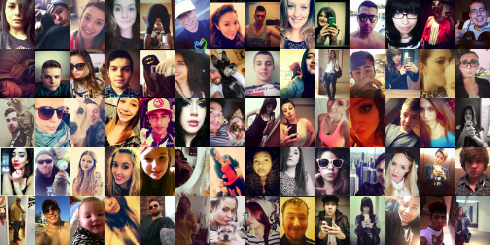

---
annotations_creators:
- expert-generated
language: en
language_creators:
- other
license:
- apache-2.0
multilinguality: []
pretty_name: Selfie Dataset
size_categories:
- 10K<n<100K
source_datasets:
- original
tags: []
task_categories:
- image-classification
task_ids: []
---

# Dataset Card for Selfie Dataset

## Table of Contents
- [Table of Contents](#table-of-contents)
- [Dataset Description](#dataset-description)
  - [Dataset Summary](#dataset-summary)
  - [Supported Tasks](#supported-tasks)
  - [Languages](#languages)
- [Dataset Structure](#dataset-structure)
  - [Data Instances](#data-instances)
  - [Data Fields](#data-fields)
  - [Data Splits](#data-splits)
- [Dataset Creation](#dataset-creation)
  - [Source Data](#source-data)
  - [Annotations](#annotations)
- [Considerations for Using the Data](#considerations-for-using-the-data)
  - [Known Limitations](#known-limitations)
- [Additional Information](#additional-information)
  - [Dataset Curators](#dataset-curators)
  - [Licensing Information](#licensing-information)
  - [Citation Information](#citation-information)

## Dataset Description

- **Homepage:** https://www.crcv.ucf.edu/data/Selfie/
- **Paper:** https://www.crcv.ucf.edu/data/Selfie/papers/acmmm15/Selfie.dfs Brisbane, Australia, October 26-30, 2015.

### Dataset Summary

Selfie dataset contains 46,836 selfie images annotated with 36 different [attributes](#data-instances).

<center>

</center>

### Supported Tasks
The dataset can be employed as the training and test sets for the following computer vision tasks: face attribute recognition, face recognition, face detection.

* `glass-detection`: The dataset can be used to train a model for Glass-detection, which consists in understanding if a subject into an image wears or not glass. Success on this task is typically measured by achieving a high accuracy. The "GlassDect" (CNN) model currently achieves the **93%** of accuracy.

### Languages

The only supported language by the Selfie dataset is english.

## Dataset Structure

### Data Instances

**[selfie_dataset.txt](./processed/selfie_dataset.txt)** provides the annotations and is structured as:
* image name 
* popularity score
* [attributes](#data-instances)

Below an example image is showed.

<center>


</center>

### Data Fields

The attributes are divided into categories as following:

* **Gender**: is female
* **Age**: baby, child, teenager, youth, middle age, senior
* **Race**: white, black, asian
* **Face shape**: oval, round, heart
* **Facial gestures**: smiling, frowning, mouth open, tongue out, duck face
* **Hair color**: black, blond, brown, red
* **Hair shape**: curly, straight, braid
* **Accessories**: glasses, sunglasses, lipstick, hat, earphone
* **Misc**: showing cellphone, using mirror, having braces, partial face
* **Lighting condition**: harsh, dim


### Data Splits

Data has been splitted with the hold-out method. A 80-10-10 split has been done on a subset of Selfie Dataset (25k samples) to create the training set, the validation set and the test set.

|                  | train | validation | test |
|------------------|-------|------------|------|
| Number of images |  20k  | 2,5k       |  2,5k|


## Dataset Creation

### Curation Rationale

The choice of the Selfie Dataset was due to the fact that, the GlassDect model has been designed as an auxiliary system for biometric authentication. The authentication action seems like taking a selfie, and this is the reason why we have chosen this dataset.  

### Source Data


#### Initial Data Collection and Normalization

In order to be used for the Glasses Detection task, a phase of feature selection has been done taking in consideration over the 36 attributes just 2 of them: `glasses`, `sunglasses`. 

From the original data collection, a `.h5` file has been created for practical reasons to be used in the training phase. 
In order to create a label that represent when a subject is wearing glasses, a logic OR has been done between the previews two labels that represent `glasses` and `sunglasses`. The results shows that the two resulting classes were unbalanced, so a balancing phase has been done using the offline data augmentation(flipped, rotation and brightness shifting) only to the images with subject wearing glasses.

A preprocessing has been done using the following techniques in the following order:

1. Face alignment: an alignment tool, which is widely used in tasks that work on faces. It can be seen as a form of “data normalization” and it is composed by 3 steps:
    - Center the image
    - Rotate the image such as the eyes lie is on horizontal line
    - Scale the image such that the size of the faces are approximately identical
2. Sharpening filter: used to enhance the edges of objects and adjust the contrast and the shade characteristics.

## Considerations for Using the Data

### Known Limitations

- Unbalanced data with respect to the classes (Glasses and No Glasses) that we are using
- High variability among all the samples in the dataset
- Some images are wrong labeled

## Additional Information

### Licensing Information

The authors said that this dataset must be limited only to the research purposes

### Citation Information

```
@inproceedings{kalayeh2015selfie,
  title={How to Take a Good Selfie?},
  author={Kalayeh, Mahdi M and Seifu, Misrak and LaLanne, Wesna and Shah, Mubarak},
  booktitle={Proceedings of the 23rd Annual ACM Conference on Multimedia Conference},
  pages={923--926},
  year={2015},
  organization={ACM}
}
```
